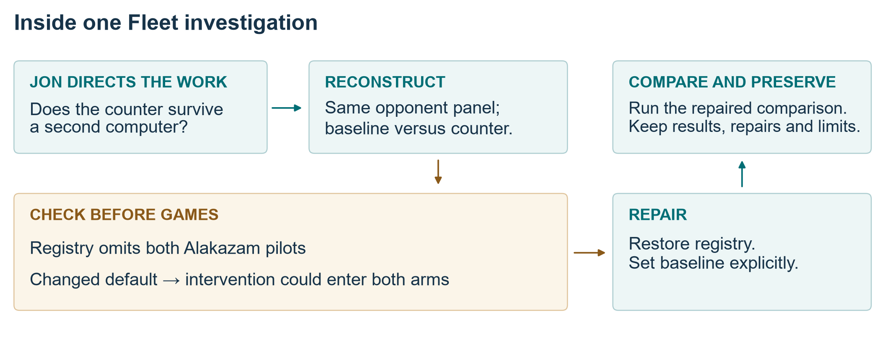

# The Fleet: Building a Research Factory for Pokémon TCG

**Sixty days of solo-directed AI research: turning game questions into experiments, player components, and reusable lessons.**

I am Jonathan Simone. Over roughly sixty days, I directed AI research and coding agents across vendors to investigate Pokémon TCG strategy, build the tools needed to test it, challenge the conclusions and preserve what should change next. This archive makes that research process and its concrete outputs inspectable.

## Start with the story

[**Read the report**](docs/STRATEGY-WRITEUP.md) · [Report PDF](docs/downloads/FINAL-REPORT.pdf) · [Evidence guide](docs/downloads/EVIDENCE-GUIDE.pdf) · [Portable evidence ZIP](docs/downloads/PTCG-EVIDENCE.zip)

## Follow a discovery

| Explore | What changed |
|---|---|
| [Five research cycles](docs/current-evidence/factory/cases/FACTORY-IN-ACTION.md) | A reconstruction halt, policy study, labeling diagnosis and memory correction changed subsequent work. |
| [Representation experiment](docs/current-evidence/factory/proofs/representation/README.md) | Two recorded caches: 48.62% to 74.25% and 47.33% to 77.26% imitation agreement. Capacity also increased; run the twelve-row recount. |
| [Original learning components](docs/current-evidence/factory/proofs/ORIGINAL-COMPONENTS.md) | Legal choices gain source/target meaning, recurrence and sequential stopping. Run seven prescribed-score decoder checks. |
| [Deck-policy counter](docs/current-evidence/numerical/METHODS.md) | Separate card and targeting changes, then inspect their combination across opponents. Recount the saved game outcomes. |
| [Eight-reference source map](docs/EVIDENCE-MAP.md) | Trace each report claim to selected sources, identities and limitations. |

The counter improved game score by 20.42 and 18.75 percentage points against two tested Alakazam implementations. The other five averaged −0.47 [−2.64, +1.71], leaving broader benefit unresolved. Representation agreement and generic component checks are different evidence from whole-game performance.

## Inspect and reproduce

[Reproduction commands](docs/REPRODUCING.md) distinguish standard-library arithmetic checks from the optional CPU PyTorch demonstration. [Contributions](docs/current-evidence/CONTRIBUTIONS.md) identifies original work and credited foundations. [Research inventory](workflow/inventories/sri/INDEX.md) and [corrections](workflow/canon/RETRACTIONS.md) preserve the larger, dated research record.

My Simulation entry was Tetsutani's unmodified public c61 Grimmsnarl player. The experimental learner and modified makthanithin community_1084 Lucario pilot are distinct artifacts. Roman Rozen's V13 policy supplied material for policy study. The research factory operated; repeated retained improvement in an integrated learned player remains future work.

[Kaggle entry](https://www.kaggle.com/competitions/pokemon-tcg-ai-battle-challenge-strategy/writeups/measure-everything) · [Researcher guide](docs/FOR-RESEARCHERS.md) · [Opponent provenance](docs/OPPONENT-PROVENANCE.md) · [Release scope](docs/RELEASE-REVIEW.md)

Project-authored materials use the [MIT license](LICENSE), with [credits and competition-use boundaries](NOTICE). The export omits organizer materials, complete player weights and third-party policy implementations. It supports source inspection and the advertised checks; it is not a complete historical game/training environment.
