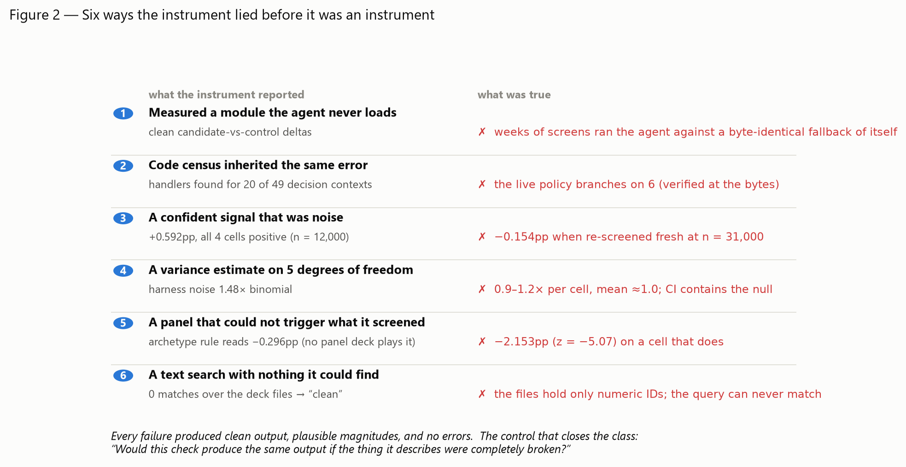

# Seven weeks of trying to make a card-game policy measurably stronger

Most of that time was spent discovering how our own instruments lied.

This repository is the research record behind a Kaggle Pokémon Trading Card Game
agent. It is not a clever agent looking for applause. It is a measurement system,
a list of things we tested, and an unusually long list of the numbers we published
and then had to withdraw.

**What was measured.** Roughly 8,400 games of controlled comparison on a
seven-opponent panel, plus tens of thousands of screening games, plus a public
leaderboard run. Every comparison is an A/B between two agents that differ by one
named change.

**The headline result.** One counter-strategy — a single card added to the deck,
plus a targeting rule — measured **+7.82 percentage points of win rate,
95% CI [+6.08, +9.56]**, across three within-batch comparisons on two machines.

**The limit on that headline, stated here and not in a footnote.** That number is a
property of the *test panel*, not of the agent. The panel is 40% one archetype
(Alakazam). When the same change was measured against seven independent opponents,
8,400 games (600 games per arm per opponent), it separated almost perfectly by
opponent deck: **+20.42** and **+18.75** percentage points on the two Alakazam
cells, and an average of **−0.47 [−2.64, +1.71]** across the other five. So
+7.82 is what a panel measured. It is not an agent-level improvement, and we do
not present it as one.

## Start here

Four pages, in the order that makes the rest legible:

1. **[The inventory index](workflow/inventories/sri/INDEX.md)** — the map of what
   was tried, why, how, what happened, and what it taught. 2,333 records across
   10 registers.
2. **[The retraction register](workflow/canon/RETRACTIONS.md)** — 16 numbers we
   published and later found to be wrong, each with the reason it was wrong.
3. **[The dead-ends register](workflow/DEAD-ENDS.md)** — closed lines of work.
   Every row carries the exact claim the evidence supports and the claim it does
   *not*, so a reader does not over-read a negative.
4. **[The strategy write-up](docs/STRATEGY-WRITEUP.md)** — the 2,000-word narrative.

Then, if you want the mechanics: **[How it plays](docs/HOW-IT-PLAYS.md)**. If you
want the method: **[What we learned](docs/WHAT-WE-LEARNED.md)**. To regenerate the
inventory yourself: **[Reproducing](docs/REPRODUCING.md)**.

## The agent we fielded is not ours, on purpose

The agent on the leaderboard is **tetsutani's public Grimmsnarl ex Damage-Transfer
Control kernel, used unmodified** (policy hash `c61e540b`, deck hash `92b92bac`).
It is a community kernel published on Kaggle. We did not write it and we did not
change a byte of it. On 6 September it scored **834.0, rank 840 of 6,807**.

This is a control, not a shortfall. A research programme that changes the product
every week cannot attribute an improvement to anything, because the baseline moves
under the measurement. We held the fielded product fixed so that every measured
delta had a fixed referent. What this repository contributes is the research
system around that fixed point and the modifications we tested against it — the
comparisons, the panels, the power analysis, and the record of which of our own
tools produced false verdicts.

The leaderboard score is a TrueSkill rating, written **μ**. It starts at 600 for a
new agent, and the displayed score is μ exactly. A gap of about 100 μ corresponds
to roughly 18 percentage points of win probability against an equally rated
opponent.

## What is actually in the record

- **The counter-strategy, decomposed.** The +7.82pp effect is not one thing. The
  deck change alone measures **+5.02 [+3.30, +6.75]**; the targeting rule alone
  measures **+3.62 [+1.52, +5.72]**. The two are additive; we tested for an
  interaction and could not distinguish it from zero.
- **A sign flip.** A tactical rule that always prefers a knockout measured about
  **+12 percentage points** against one opponent deck and about **−10** against a
  deck close to our own. Pooled across the panel it looked like nothing. The
  average of two opposite effects is not a null.
- **A learned agent that lost.** We trained a policy on our own data. Its held-out
  loss improved from **1.07178 to 1.04176** — and it then won **23 of 1,200**
  decided games against the fielded agent (1.92%, 95% CI [1.22, 2.86]). A better
  loss curve was not a better player. This is written up in full rather than
  quietly dropped.
- **The instruments.** Ten measurement tools each produced at least one false
  verdict before we caught them: an opponent pool made of our own agent, an
  experiment path that never carried the setting under test, sample sizes that
  could not resolve the effects being claimed, a broken log schema, and more.
- **The test suite as a record of distrust.** 494 test suites, roughly 116,000
  lines of test code, **58% of which contain assertions that a component must
  refuse bad input** rather than merely produce output.
- **5,876 commits** since 2026-07-08. The public repository is a squashed import,
  so that history is not browsable here; the number is stated as a fact about the
  private working repository, not as something you can click.

## What is NOT here

- **The competition engine and the card data.** These are provided by the
  competition organisers under their own terms and are not ours to redistribute.
  Nothing in this repository will play a game without them.
- **Raw game logs.** Hundreds of thousands of games produced trace files far too
  large to publish. What is published is the aggregated result, its sample size,
  its interval, and the script that produced it.
- **Any private competitor's code.** Third-party kernels used in this work are
  public, licensed, and attributed in [NOTICE](NOTICE).

## Licence and attribution

Our own code and documents are MIT-licensed ([LICENSE](LICENSE)). Third-party work
we build on — makthanithin's Apache-2.0 sample kernel, tetsutani's fielded kernel —
is credited in [NOTICE](NOTICE) with the licence and the list of what we changed.
