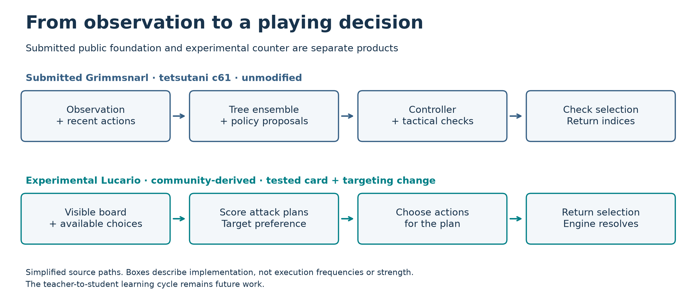
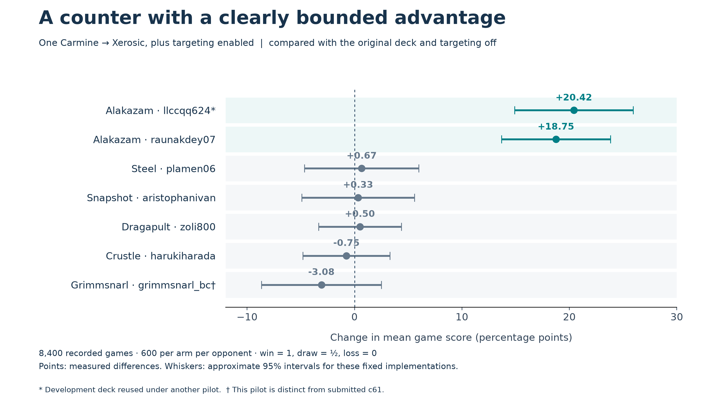
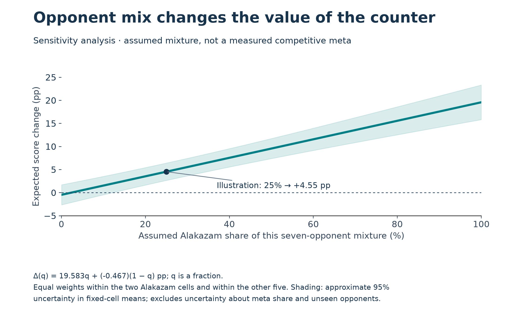

<!--
This page is the manuscript submitted to the Kaggle Strategy track on
2026-09-06. Its text is reproduced from PTCG_FINAL_UPLOAD_2026-09-06/FINAL-REPORT.md
(sha256 22e0d43a736a9db1e7a9f7ed67bd1933a6faebc7bde9ed3a687a32c28169ff4e).
The only changes are the three figure paths and the eight evidence references,
which are repointed at the copies of those exact files inside this repository.
No sentence of the report has been edited. See docs/EVIDENCE-MAP.md.
-->

> **This is the current report.** It supersedes every earlier draft in this
> repository, including the September 4 draft preserved at
> [docs/historical/2026-09-04-strategy-draft-v18.md](historical/2026-09-04-strategy-draft-v18.md).
> Figures and numbered evidence below link to the files they were computed from.

# Building and Testing a Pokémon TCG Counter-Strategy

*Learning Pokémon TCG through experiments that survive inspection*

Jonathan Simone · Simone Systems Research

## Learning the game meant building the laboratory

I entered this competition as one human researcher learning an unfamiliar game while building its software. I used AI coding and research workers to investigate opponents, implement candidate agents, run comparisons and challenge interpretations. The work grew into a research laboratory with local compute and a memory of its experiments.

Its clearest result is a selective counter-strategy. A card substitution and targeting change improved an experimental Mega Lucario product by **7.82 percentage points [6.08, 9.56]** on a development panel containing 40% Alakazam, across three within-batch comparisons on two computers. A later panel located the advantage more precisely: two Alakazam implementations gained strongly, while broader improvement remained unresolved.

My Simulation submission used **tetsutani’s unmodified public Grimmsnarl ex Damage-Transfer Control**, policy hash `c61e540b`, deck hash `92b92bac`. The September 6 leaderboard records **834.0, rank 840 of 6,807**. The post-submission Lucario experiments use a separate derivative of makthanithin’s Apache-2.0 community_1084 policy. My contributions are the research system, tested modifications and evidence explaining their limits. [1, 2, 7]

## The playing program and the research system

The submitted Grimmsnarl program combines a context-routed tree ensemble, strategic fallback and specialist policies. It scores options using state, action features and recent history. A controller arbitrates; tactical and development checks may revise its choice. It checks selection bounds, uniqueness and indices, and asserts the fixed deck at load. These are features of the credited public implementation, inspected at its matching source hash. [6]

The experimental Lucario pilot uses rules to score choices and construct an attack plan. Its decisions connect board development, available Energy, attack damage and target selection. The targeting intervention adds a preference for visible Abra or Kadabra when the opponent’s Alakazam line is detected. This changes a concrete decision procedure; it does not require a language model to choose every move.

*Figure 1. Source-level architecture. The submitted public implementation and experimental derivative are distinct; neither diagram establishes a completed learning cycle.*

We also explored sampled-state search, learned scorers and feature representations. Search can expose an alternative but value it poorly; a scorer can imitate accurately without improving play. A stronger deck can change outcomes without its pilot learning anything.

A separate owned student improved held-out imitation loss but won only **23 of 1,200 decided games (1.92%)** against exact c61 on the same Grimmsnarl list. Better prediction metrics had not produced a competitive replacement. The practical lesson is to assess learned policies in fresh complete games alongside imitation metrics. Training identities, draw handling and causal limitations remain in the supporting receipts. [3]

Workers used owned tasks, isolated directories and non-author review. The remaining goal is a learning cycle: a stronger teacher supplies decisions, a student retains the advantage, and fresh games verify retention. We have not established that cycle.

## Deck strategy: turn preparation into Prizes

The submitted 60 contains 18 Pokémon, 32 Trainers and 10 Basic Darkness Energy. Its game plan connects evolution, distributed damage and transfer into prize opportunities:

| Package | Strategic role |
|---|---|
| Impidimp ×4, Morgrem ×3, Grimmsnarl ex ×3; Rare Candy ×3 | Establish the main attacker. Evolving Grimmsnarl from hand can accelerate Darkness Energy onto Marnie’s Pokémon. |
| Munkidori ×4 | With its own Darkness attachment, transfer up to three damage counters from one friendly Pokémon to an opposing Pokémon. |
| Snorunt ×2, Froslass ×2 | Froslass adds damage counters during Checkup to Pokémon with Abilities, including friendly ones, except Froslass. |
| Boss’s Orders ×2; Night Stretcher ×3 | Bring a prepared target Active and recover resources for subsequent turns. |

This produces a concrete allocation problem. Grimmsnarl’s acceleration does not power Munkidori: the latter needs a separate Darkness attachment. Shadow Bullet pressures the Active for 180 and a Benched target for 30, while transfer can concentrate existing counters. The pilot must prepare both the attack and the transfer opportunity without neglecting replacement attackers. Counts and mechanics were checked against the recovered package. [6]

Two recorded choices of Shadow Bullet’s 30-damage Bench target make the tradeoff concrete. One targeted a 140-HP Alakazam while a 20-HP Alakazam was available; another targeted a 90-HP Drakloak while a 30-HP Budew was available. The first game was lost; the second was won. We verified both choices in the original seat-visible records. Neither outcome reveals whether taking the lower-HP target would have improved the result. [8]

The rationale for the Lucario counter is to pressure two resources in Alakazam’s strategy: the hand that powers its attack and the visible evolution line that develops its board. Replacing one Carmine with Xerosic tests hand disruption; preferring visible Abra or Kadabra tests pressure on development. Separating the changes experimentally distinguishes the contribution of the deck modification, the targeting rule and their interaction.

In the supplied card data, **Alakazam’s** Powerful Hand places two damage counters per card in its player’s hand; Kadabra has a different attack. Xerosic reduces the opposing hand to three cards when resolved, reducing that resource until it is replenished. This supplies a plausible mechanism for the counter, but terminal wins alone cannot establish how often this sequence caused the advantage. [6]

This is a tradeoff, not a free upgrade. Removing a draw Supporter changes access to resources. Using a disruptive Supporter competes with development or gusting on that turn. Targeting a developing threat can direct pressure away from another prize opportunity. A persuasive card interaction therefore needs complete-game evidence.

The experiment separates list and pilot through a factorial design:

| | Original list | One Carmine replaced by Xerosic |
|---|---|---|
| Targeting disabled | Control | Card change alone |
| Targeting enabled | Rule change alone | Combined product |

The four-arm batch used 2,000 games per arm. Recomputing the development rows gives a rule-only gain of **+3.62 points [1.52, 5.72]** across two batches; the card-only gain is **+5.02 [3.30, 6.75]** across three. The combined product gained +7.82 across three comparisons. Each contrast uses its own batch’s control, decided games and inverse-variance pooling. The interaction did not establish synergy. These development results do not establish broader superiority. [2]

Our deck-construction contribution is the tested Carmine-to-Xerosic modification of the experimental Lucario list; the submitted Grimmsnarl list remains credited to its public author.

## The opponent panel reveals the scope of the gain

The subsequent panel contains **8,400 game records: seven opponent implementations, 600 games per arm per opponent**. The candidate carries both changes; the baseline carries neither. Figure 2 recomputes each difference directly from terminal outcomes, scoring a win as 1, a draw as ½ and a loss as 0. This convention differs from the development replication’s decided-game analysis, so their summaries are kept separate. [4]

*Figure 2. Combined card-and-rule intervention minus baseline. Approximate 95% intervals assume independent games and condition on these implementations. One Alakazam deck overlaps development under another pilot. The Grimmsnarl pilot here is distinct from submitted c61.*

The two Alakazam cells gained **20.42 and 18.75 points**. The equal-weight mean of the other five is **−0.47 points**, with an approximate interval of **[−2.64, +1.71]**. Modest benefit and harm remain plausible for that group. The visible concentration supports a specialist interpretation; it neither proves the mechanism nor establishes an advantage against every member of an archetype.

A new pilot on a familiar list is a weaker generalization test than a new pilot and list.

## A counter’s value depends on whom it faces

A panel average is meaningful only for its opponent mixture. For an illustrative field with Alakazam fraction q, equally weighting the two tested Alakazam implementations within their group and the other five within theirs:

**Δ(q) = 19.583q − 0.467(1 − q) percentage points.**

At q = 0.25, the point estimate is +4.55 points. Figure 3 shows the sensitivity across possible mixtures. This is a calculation from the same panel, not another replication, an estimate of the competitive meta, or a deployment threshold.

*Figure 3. Expected score change under an assumed mixture of the seven tested opponents. The band covers approximate uncertainty in their measured means; it excludes uncertainty about meta share and unseen opponents.*

The strategic lesson is practical: evaluate a counter against the opposition it is intended to face. A gain concentrated in one matchup can be useful without qualifying the product as a universal replacement. Further claims require appropriate fresh opposition and a declared mixture.

## Preserve the experiment, including why its conclusion changed

The inventory connects research questions to implementations, outcomes, corrections and reopening conditions. Its reader searches records, retrieves evidence and reports source identities and coverage. It lets a new worker recover the experiment behind a conclusion without reading the entire project. A missing search result remains a coverage limitation, not proof that work never happened. [5]

That memory is a reusable research asset, but its existence does not establish improved agent behavior. The next useful test is whether a fresh worker can recover the right baseline, interpret a result correctly and prepare the justified next comparison with less human repair.

The project produced a measured Lucario counter with strong gains against two tested Alakazam implementations, while broader improvement remained unresolved. It also demonstrated a reusable method: separate deck changes from policy changes, compare each with its control, challenge aggregate gains across opponents, and examine how the counter’s value changes with the assumed opponent mixture. That is a concrete foundation for learning strategically under uncertainty.

## Evidence

The attached PTCG-EVIDENCE.zip contains numbered source routes and file hashes in START-HERE.md. Original records retain their limitations; some underlying local assets are not redistributed. AI agents assisted implementation, analysis and writing under my direction.

1. Submitted-product provenance: [lane-s-c61-provenance-receipt.json](../workflow/research/owned-learning-roadmap-20260813/lane-s-c61-provenance-receipt.json).
2. Factorial design and replication: [2026-09-03-xerosic-sniper-factorial.md](../workflow/research/2026-09-03-xerosic-sniper-factorial.md); [ABLATION-VERIFICATION.json](../workflow/writeup/visuals-2026-09-06/ABLATION-VERIFICATION.json); [development rows](../workflow/research/2026-09-03-xerosic-sniper-rows.csv).
3. Owned student: [LEARNING-VERIFICATION.json](../workflow/writeup/visuals-2026-09-06/LEARNING-VERIFICATION.json); [training](../workflow/writeup/visuals-2026-09-06/learning-evidence/training-receipt.json) and [complete-game](../workflow/writeup/visuals-2026-09-06/learning-evidence/screen-receipt.json) receipts.
4. Fresh-opponent panel: [2026-09-03-strike3-rows.csv](../workflow/research/2026-09-03-strike3-rows.csv); [generalisation report](../workflow/research/2026-09-03-strike3-generalisation.md); [counterplay-data.json](../workflow/writeup/visuals-2026-09-06/counterplay-data.json).
5. Research-memory interface: [knowledge-register/README.md](../workflow/knowledge-register/README.md). Full tool and acceptance are outside this attachment.
6. Recovered product, deck and mechanics: [SOURCE-VERIFICATION.json](../workflow/writeup/visuals-2026-09-06/SOURCE-VERIFICATION.json). Source inspections, not redistributed card data.
7. Dated competition result: [COMPETITION-VERIFICATION.json](../workflow/writeup/visuals-2026-09-06/COMPETITION-VERIFICATION.json).
8. Two original replay choices: [REPLAY-CHOICE-VERIFICATION.json](../workflow/writeup/visuals-2026-09-06/REPLAY-CHOICE-VERIFICATION.json). Original episodes are not redistributed.
