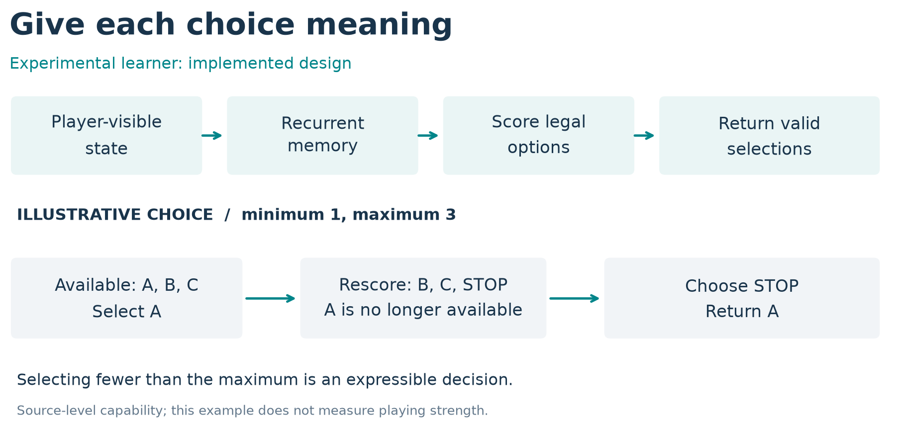
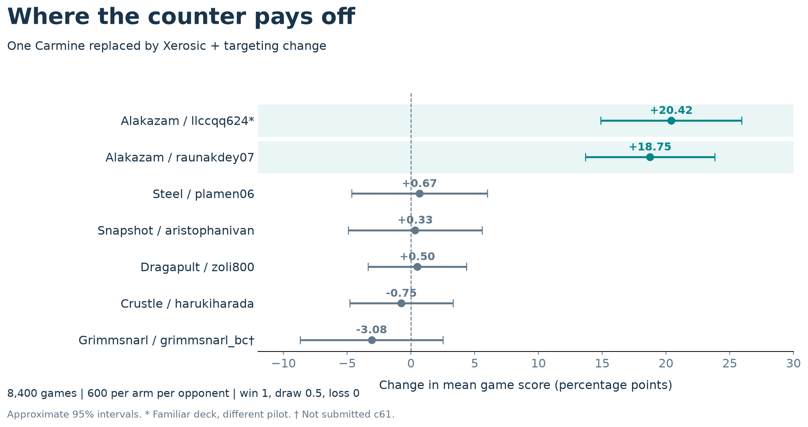
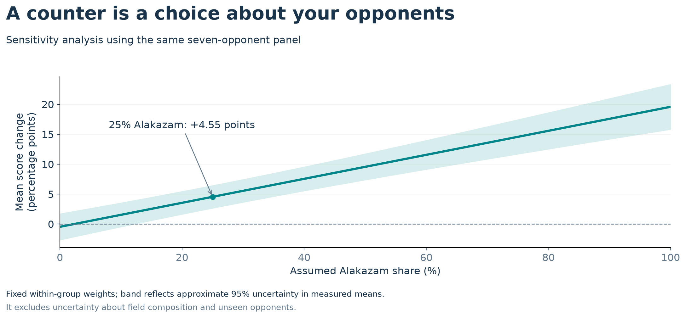

# From Research Agents to Better Pokémon TCG Decisions

*60 days of player design, deck-policy experiments, and a tested Alakazam counter.*

Jonathan Simone

## A player that can keep improving

I entered this competition learning Pokémon TCG and asking a larger question: how could I build a player that keeps getting better? Over roughly 60 days, I worked as a solo developer with AI coding and research agents across multiple vendors. We called them "The Fleet". They helped investigate opponents, implement ideas and compare results while I directed the work.

The project developed along two connected research questions: how to teach a player useful behavior, and how to identify behavior worth teaching. I built components of a recurrent learning player and tested strategic modifications in a separate Lucario pilot. One combination, hand disruption plus pressure on Alakazam's evolution line, improved mean game score by roughly 19–20 percentage points against two tested Alakazam implementations.

That result is a concrete step toward the larger objective. The learning player and the counter remain separate experimental branches; connecting discoveries to retained improvements is the next milestone.

## What I submitted and what I developed

| Artifact | Contribution and evidence |
|---|---|
| Simulation submission | Tetsutani's unmodified public Grimmsnarl ex Damage-Transfer Control: policy c61e540b, deck 92b92bac. September 6 score: 834.0; rank 840/6,807. |
| Experimental learned player | My implementation of visible-state encoding, recurrent memory, legal-option scoring and sequential selection, using established learning methods. |
| Experimental Lucario counter | My card substitution, targeting modification and comparisons on a derivative of makthanithin's Apache-2.0 community_1084 policy. |

The public implementations supplied working players, teachers and controls. The later experimental results below belong to their named development branches, rather than to the submitted agent's ladder score. [1, 2, 3]

## A legal move needs meaning

A TCG player faces a changing menu of choices: attach Energy, evolve a Pokémon, choose an attack, or select its target. Learning “choose option three” would give the same number different meanings as the menu changes. My learner instead encodes the offered actions and scores their features against the current game context.

The current v2 design links each option to its source and target, combines encoded state with a 256-unit recurrent network, and scores the available options. Recurrence provides a place to retain information across decisions; legal masking restricts selection to allowed options. The state projection uses the acting player's view, distinguishes self from opponent, and explicitly rejects hidden-information fields. These choices make observation, memory and action selection inspectable parts of the design. [2]

Selecting several items creates another problem. If a choice allows up to three selections, taking all three is a decision, not an obligation. The decoder selects without replacement, updates its selection context, and offers a learned STOP choice once the minimum is satisfied. Figure 1 illustrates this interface; it is an explanatory example rather than a recorded match.

*Figure 1. Implemented design: visible state and recurrent memory score legal options. Sequential selection respects minimum/maximum bounds and can stop early. The schematic illustrates expressible choices, not measured tactical quality.*

These components give a learned policy the means to express game decisions. They also separate questions that can otherwise become tangled: can the player represent a choice, can it learn that choice, and does choosing it improve complete-game outcomes?

## Practice creates new teaching opportunities

A developing player reaches positions an expert may rarely encounter. Teacher-query tooling therefore reconstructs player-visible positions and requests choices from a credited public teacher, providing a route to advice on the learner's own situations. Training, checkpoint handling and inference are separate components, so the teacher or player can change without redefining the whole experiment. [2]

An earlier August student checkpoint improved held-out imitation loss and completed a 1,200-decided-game comparison against exact c61 on the same Grimmsnarl list, winning 23 games. That checkpoint was not a competitive replacement. The comparison reinforced the need to assess learning through fresh complete games alongside prediction metrics; it does not evaluate the current v2 implementation. [3]

The research question then becomes practical: what useful behavior should a player acquire? The Lucario experiment provides one well-defined answer to investigate.

## Decks turn resources into a game plan

My submitted Grimmsnarl list contains 18 Pokémon, 32 Trainers and 10 Basic Darkness Energy. Its central engine combines Grimmsnarl ex's attacks with Froslass damage counters and Munkidori's damage transfer. Four Impidimp, three Morgrem, three Grimmsnarl and three Rare Candy support attacker development; four Munkidori and two Froslass support damage placement. Boss's Orders brings prepared targets Active, while Night Stretcher recovers resources. [4]

The interactions create meaningful allocation choices. Grimmsnarl's evolution ability accelerates Darkness Energy onto Marnie's Pokémon; Munkidori needs its own Darkness attachment to transfer counters. Shadow Bullet deals 180 damage to the Active and 30 to a Benched target. The player must balance immediate prizes, distributed damage and development of the next attacker. The credited submitted program combines learned option scoring with tactical checks and specialist fallback policies. [4]

The experimental Lucario pilot approaches play through rules connecting board development, available Energy, attack damage and target selection. My intervention focuses on the opponent's resources: the hand that powers Alakazam and the evolution line that prepares it.

Mega Lucario ex connects attack and preparation: Aura Jab deals 130 damage for one Fighting Energy and can attach up to three discarded Basic Fighting Energy to Benched Pokémon. Mega Brave offers 270 damage for two Fighting Energy, but that Pokémon cannot use it on its next turn. Energy recovery and preparing the next attacker therefore matter alongside immediate damage. [4]

Alakazam's Powerful Hand places two damage counters for each card in its player's hand. Xerosic reduces a large opposing hand to three cards when resolved. Replacing one Carmine with Xerosic therefore tests whether disruption is worth sacrificing a draw Supporter. The targeting modification separately prefers visible Abra or Kadabra when the opponent's Alakazam line is detected. [4]

Pressure on both resources is a plausible counter: reduce the current attack resource while threatening future attackers. There are costs. Playing Xerosic uses the Supporter opportunity that could have supported development or gusting; attacking an evolving threat can forgo a different prize opportunity. Alakazam can also replenish its hand. These tradeoffs make the whole-game experiment essential.

## Was it the card, the targeting, or both?

I separated the changes in a four-arm experiment:

| | Original list | Carmine replaced by Xerosic |
|---|---|---|
| Original targeting | Control | Card change alone |
| Modified targeting | Rule change alone | Combined product |

The four-arm batch used 2,000 games per arm. Development comparisons gave a rule-only improvement of +3.62 percentage points [1.52, 5.72] across two batches, a card-only improvement of +5.02 [3.30, 6.75] across three, and a combined improvement of +7.82 [6.08, 9.56] across three comparisons on two computers. Brackets give 95% intervals. These use within-batch controls, decided games and inverse-variance pooling on a panel containing 40% Alakazam. The interaction did not establish synergy. [5]

A later evaluation asked where the combined advantage appeared. It contains 8,400 game records: seven opponent implementations, 600 games per arm per opponent. Here game score is win = 1, draw = ½, loss = 0, distinct from the development analysis's decided-game convention. [6]

*Figure 2. Combined intervention minus baseline, with approximate 95% intervals conditional on these implementations and independent games. One Alakazam deck overlaps development under a different pilot; this panel's Grimmsnarl pilot is not submitted c61.*

The two Alakazam cells improved by 20.42 and 18.75 points. The other five averaged −0.47 [−2.64, +1.71], leaving broader benefit unresolved. The result demonstrates a substantial counter advantage in those tested matchups. Terminal outcomes support the product comparison; they do not identify which individual disruption or targeting sequence caused each win.

## A counter's value changes with the opposition

The matchup pattern is strategically useful. If Alakazam represents a fraction q of an assumed field, equally weighting the tested implementations within the Alakazam and other-opponent groups gives:

**Expected score change = 19.583q − 0.467(1 − q) percentage points.**

At q = 0.25, the point estimate is +4.55 points. This calculation reuses the same panel; it is a sensitivity analysis, not an estimate of the competitive metagame or a new replication. [6]

*Figure 3. Counter value under an assumed mixture of the seven tested opponents. Uncertainty covers their measured means, not unknown opponents or the assumed field composition.*

For another builder, the reusable method is straightforward: change the deck and policy separately, compare their combination, then examine the opponents behind the average. That turns a headline improvement into a reasoned strategic choice.

## The next generation

The fleet let me pursue player design and strategic experiments alongside each other. Its research records link questions to implementations, outcomes and sources, preserving material for the next experiment. This memory across research sessions is distinct from the player's memory within a game and the parameter changes produced by training. [7]

I am continuing toward a modular system in which practice produces teaching material, strategic discoveries inform the player, and fresh games establish which improvements it retains. These 60 days produced implemented learning components, a tested matchup counter and a method for valuing it. My next objective is to connect those pieces into repeated, demonstrated improvement.

## Evidence and acknowledgements

The accompanying source notes map claims to existing evidence and inspected code excerpts: [1] submitted provenance and dated score; [2] learner, decoder and teacher tooling; [3] student training and game comparison; [4] recovered deck and mechanics; [5] factorial comparisons; [6] seven-opponent rows and mixture calculation; [7] research memory and continuing architecture. Some underlying assets, including one development host's raw rows and training weights, are not redistributed. AI agents assisted implementation, analysis and writing under my direction.

---

[Evidence map: references 1–7](EVIDENCE-MAP.md) · [Download report](downloads/FINAL-REPORT.pdf) · [Evidence guide](downloads/EVIDENCE-GUIDE.pdf) · [Evidence ZIP](downloads/PTCG-EVIDENCE.zip)
