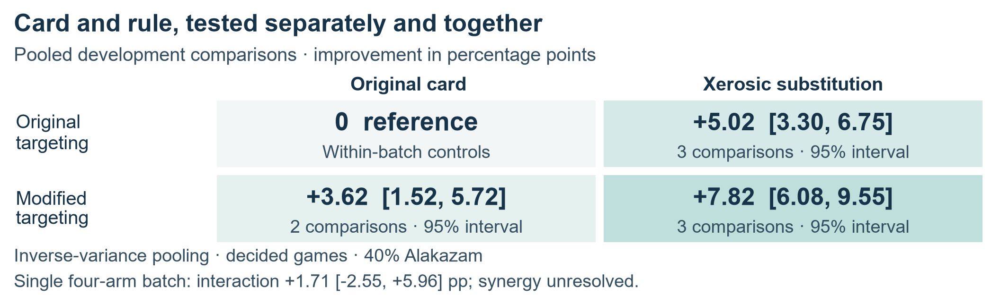
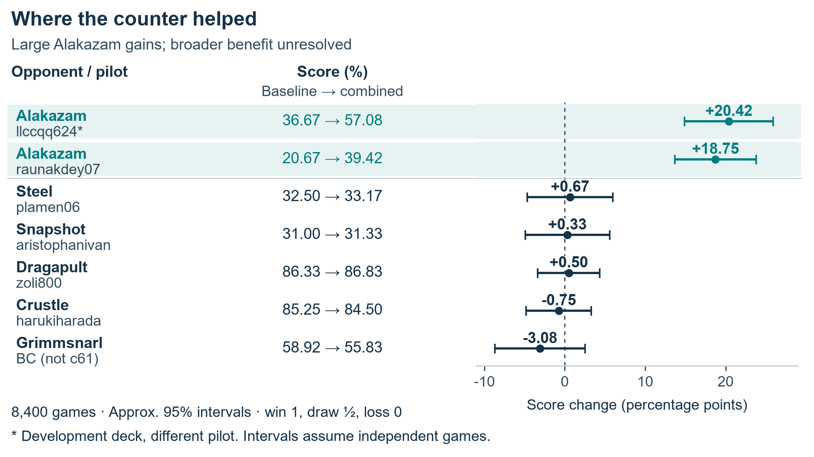

# The Fleet: Building a Research Factory for Pokémon TCG

*Sixty days of solo-directed AI research: turning game questions into experiments, player components, and reusable lessons.*

Jonathan Simone

## The strategy behind the player

A Pokémon TCG player can take a prize now and leave itself without an attacker next turn. How could I discover decisions that improve the whole game, then teach them to an agent? My strategy was to build a research factory around that problem.

My Simulation entry was Tetsutani's unmodified public Grimmsnarl ex Damage-Transfer Control, policy c61e540b and deck 92b92bac. As read on September 6, its score was 834.0, rank 840/6,807. The experimental results below belong to their identified development branches. [7]

Over roughly sixty days, I learned the game as a solo developer directing AI research and coding agents across vendors, calling them The Fleet. I organized their work around a scientific cycle: investigate a question, build the necessary tool, test a hypothesis, challenge the interpretation, and preserve what should change next. This produced original learning components, experiments in teaching and representation, and a separate Lucario deck-policy counter with approximately 19–20 percentage-point gains against two tested Alakazam implementations, without established broader benefit. The factory operated; its intended endpoint—a learned player repeatedly retaining those discoveries—remains unfinished. [1–6]

*Figure 1. A documented review-and-repair case. Arrows summarize research dependencies; they do not depict a completed student-learning loop. [1,6]*

## Organize inquiry, implementation, and challenge

To make a solo project cover more ground, I separated parallel investigation from independent review. Across the campaign, I directed a strategy lead, researchers, implementers, agents responsible for two compute machines, and adversarial reviewers. I set objectives and constraints and redirected work when evidence challenged the plan. The tested policies selected moves; Fleet agents conducted development and evaluation. [1]

Review protected the strategic question. A second-machine reproduction risked excluding both target Alakazam opponents and enabling the intervention in both arms. Repairing the registry and setting the control explicitly preserved the intended comparison before that reproduction ran. [1,6]

## Discover what the learner could use

Public players supplied labels and material for investigation. In one study, we replayed recorded decisions from Roman Rozen's V13 policy and compared its choices with our working pilot. Disagreements suggested three testable behaviors: establishing Riolu, promoting Mega Lucario ex, and choosing when to evolve. These observations became separate, default-off policy modules. A disagreement identified a hypothesis; its frequency alone did not establish which action was better. [2]

Search raised another prerequisite: could we faithfully test alternatives from a recorded position? A replay-state proof of concept matched seven transitions before shuffled menus exposed the need to translate actions by their meaning instead of reusing option numbers. This established a small building block for counterfactual experiments, with broader continuation and useful alternative-action selection still unproved. [2]

Labeling raised a related question: what information could the trainer actually absorb? Parallel investigations examined the training consumer, labeling methods, local-model behavior, and failure cases. Inspecting the loss revealed that the proposed weighting labels ultimately entered training through one relative loss weight per row. A richer taxonomy could improve how that weight was estimated, but added categories alone did not create new learning channels. [3]

An initial batch of 46 quarantined model drafts all mapped to the default weight. Investigators enriched the episode evidence and the second machine tested eight previously inconclusive episodes: five yielded non-abstaining explanations, but all eight retained default weight. Correctness and training benefit remained unestablished. The lesson was to test the evidence-to-training path before scaling label production. [3]

## Give decisions enough meaning

Could the learner distinguish the teacher's choices? Two cached imitation probes compared an identity-embedding variant with the baseline. The table reports mean raw validation accuracy across three recorded seed comparisons per cache; the first used matched seeds and splits. [4]

| Recorded cache | Examples | Baseline | Identity variant |
|---|---:|---:|---:|
| First teacher cache | 44,343 | 48.62% | 74.25% |
| Second public-teacher cache | 66,030 | 47.33% | 77.26% |

Capacity also increased. Higher imitation agreement did not measure playing strength. These probes are distinct from the hashed-representation failures that prompted rebuilding our information interface while retaining replay and training components. [4,5]

The current v2 architecture links legal options to their available sources and targets. For example, a Darkness Energy attachment can enable Munkidori's damage transfer or develop another attacker: its target changes the strategic meaning. This illustrates the interface, not a demonstrated learned tactic. A 256-unit recurrent network supplies context across decisions using the acting player's view, while offered options are scored by their features instead of permanent menu positions. [5,7]

Optional choices also matter strategically. An effect allowing up to three selections may be best used with fewer. My sequential decoder selects without replacement, updates its context, and permits a learned STOP after the minimum. For unordered targets, the training objective sums the probabilities of valid selection orders, so selecting the same set in another order is acceptable. These are implemented components; seven runnable checks with prescribed scores demonstrate their selection constraints. [5]

Complete games remained a separate test. In an August experiment, 1,358 teacher-labeled learner decisions were mixed into training. The selected checkpoint improved its validation loss but won only 23 of 1,200 decided games against exact c61 on the same Grimmsnarl deck. This evaluates the recorded August checkpoint. Better imitation had not established a competitive replacement. [5,7]

## Treat the deck and policy as one strategic object

The entered Grimmsnarl deck aims for six Prizes through direct attacks and prepared damage-counter knockouts. Its 18 Pokémon, 32 Trainers and 10 Darkness Energy support that plan. Four Impidimp, three Morgrem, three Grimmsnarl and three Rare Candy provide two evolution routes. [7]

*Figure 2. Resource relationships, not a single-turn script. Evolution timing applies; Punk Up triggers on evolution from hand and attaches Energy from the deck. Checkup is between turns. [7]*

Spending an attachment on Munkidori competes with preparing another attacker. Boss's Orders brings a prepared target Active; Night Stretcher recovers Pokémon or Basic Energy. My recorded adoption rationale favored c61 over the prior V13 player in a frozen local comparison; reviewed alternatives subsequently failed the required execution and whole-game improvement gates. [7]

The clearest positive case used a derivative of makthanithin's Apache-2.0 community_1084 Lucario policy. Mega Lucario ex's Aura Jab deals 130 for one Fighting Energy and can attach up to three discarded Basic Fighting Energy to Benched Pokémon. Mega Brave deals 270 for two Fighting Energy but cannot be reused by that Pokémon next turn. Preparing a successor attacker therefore matters alongside taking the current prize. [6]

Against Alakazam, we tested pressure on two resources. Powerful Hand places two damage counters per card in its player's hand. Replacing one Carmine with Xerosic gave the pilot a way to reduce a large opposing hand to three. Separately, modified targeting preferred visible Abra or Kadabra when the Alakazam line appeared, bringing a Benched target Active when possible and threatening future attackers. Disruption costs a Supporter opportunity; targeting an evolving threat can forgo another prize. The targeting rule depends on Alakazam, while hand disruption can affect other matchups too. Whole-game comparisons therefore matter. [6]

*Figure 3. Pooled contrasts; the interaction uses only the single four-arm batch. [6]*

One complete four-arm experiment used 8,000 games. The pooled analysis includes it within 28,000 records on a 40%-Alakazam panel, using inverse-variance weighting. The estimates share factorial arms. All three combined comparisons were positive, including the second-machine reproduction; the interaction did not establish synergy. [6]

*Figure 4. A later seven-opponent panel: 600 games per arm per opponent, balanced by seat. Intervals condition on these implementations and independent games. [6]*

The two Alakazam cells improved by 20.42 and 18.75 points. The other five averaged −0.47 [−2.64, +1.71]. Excluding the overlapping deck in a historical sensitivity analysis also left broader benefit unresolved. In a separate 16,000-game comparison, both Lucario arms faced exact c61: adding the intervention changed decided-game win rate by −0.14 [−1.68, +1.40] points, without establishing equivalence. Terminal records measure product outcomes without identifying the move sequences responsible. [6]

## Make the next investigation remember

As work accumulated, context became a research bottleneck. A proposed lethal-search rerun was withdrawn when we found an earlier audit already on disk. That incident helped motivate an inventory connecting questions, methods, results, corrections, limitations, and conditions for reopening a hypothesis. The September 6 inventory snapshot indexed 2,333 project artifacts, including code, documents and data. Recovering the earlier audit and its limits changed the next research decision. [8]

The factory also needed correction. Independent review found that the memory reader dropped an introductory retraction even though its source hashes were correct. The repair preserved that text and added a regression check that it remained visible and searchable. This memory across research sessions is distinct from a player's recurrent memory and from changes to trained weights. [1,8]

My contribution is the research method and its concrete outputs: inspectable player components, tested teaching and representation choices, a controlled matchup counter, and a record that can challenge the next idea. The next generation I envision connects those pieces: teach validated decisions to a student, test fresh complete games against its parent, then repeat while checking earlier matchups. The research cycles documented here are the foundation for that still-uncompleted learning loop.

## Evidence and acknowledgements

Source notes map [1] Fleet operation and review; [2] policy dissection; [3] labeling; [4] representation; [5] learning components and teaching; [6] counter experiments; [7] submission and deck; [8] memory and corrections. Supporting records distinguish source inspection, retained historical results, reproducible arithmetic, and unresolved execution details. Public teachers are credited; recurrent and imitation-learning methods are established. AI agents assisted implementation, analysis, and writing under my direction.
