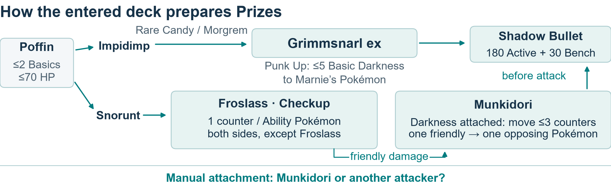
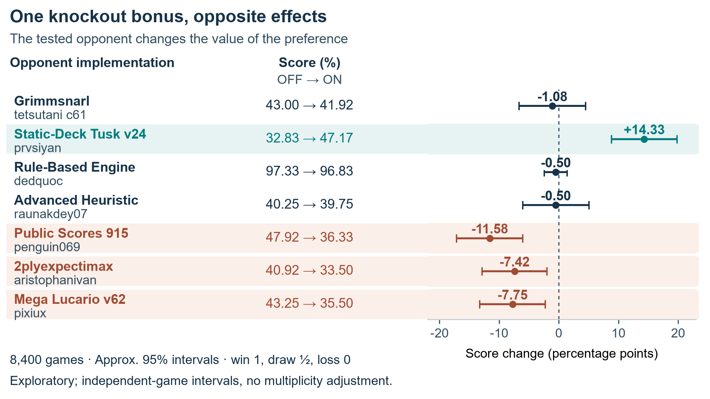

# The Fleet: Building a Research Factory for Pokémon TCG

*Sixty days of solo-directed AI research into hand disruption, Energy recovery, and the whole-game cost of a good move.*

Jonathan Simone

## When does a good move make a better player?

A Pokémon TCG player can take a Prize now and leave the opponent's main attacker untouched. It can recover Energy and weaken the search that establishes its next attacker. My strategy was to build a research factory that could turn these competing demands into experiments: identify a decision, change it, measure complete games, challenge the interpretation, and preserve what should change next.

Over roughly sixty days, I directed AI research and coding agents across vendors, calling them The Fleet. As the solo developer, I set objectives, coordinated researchers and implementers across two machines, and assigned independent reviewers to challenge assumptions. The policies selected game actions; Fleet agents developed and evaluated them. This report follows three separate research cases: a counter with 19–20 percentage-point gains against two tested Alakazam implementations, a recovery substitution, and a knockout rule whose effects changed sign across opponents. [1,6,9,10]

My Simulation entry was Tetsutani's unmodified public Grimmsnarl ex Damage-Transfer Control, policy c61e540b and deck 92b92bac. Its September 6 standing was 834.0, rank 840/6,807. A contemporaneous local comparison favored c61 over the previous V13 player; reviewed replacements subsequently failed execution and whole-game improvement gates. These are the recorded retention reasons, not a newly reproduced selection experiment. The research products below are separate from that entry. [7]

## The entered deck: prepare damage, then convert it into Prizes

The entered list contains 18 Pokémon, 32 Trainers and 10 Basic Darkness Energy. Four Impidimp, three Morgrem, three Grimmsnarl and three Rare Candy provide two evolution routes. Its plan combines direct attacks with prepared damage-counter knockouts. Punk Up accelerates Energy onto Marnie's Pokémon when Grimmsnarl evolves from hand; Munkidori requires a separately allocated Darkness attachment. [7]

*Figure 1. Resource relationships across turns. Punk Up takes Energy from the deck; evolution timing applies. Checkup is between turns. [7]*

Froslass creates a useful tension: its Checkup counters reach both sides, while friendly damage can become material for Munkidori's transfer. An attachment can enable that transfer or prepare another attacker. Boss's Orders brings a prepared target Active; Night Stretcher recovers a Pokémon or Basic Energy. Transfers precede the attack that ends the turn. These choices explain the credited deck's resource allocation. [7]

## Experiment 1: attack the hand and the next attacker

Our counter used a derivative of makthanithin's Apache-2.0 community_1084 Lucario policy. I contributed the card substitution, targeting modification and comparisons. Mega Lucario ex's Aura Jab deals 130 for one Fighting Energy and can attach up to three discarded Basic Fighting Energy to Benched Pokémon. Mega Brave deals 270 for two Fighting Energy but cannot be reused by that Pokémon next turn. Developing a successor therefore competes with maximizing the current attack. [6]

Alakazam's Powerful Hand places two damage counters per card in its player's hand. Replacing one Carmine with Xerosic offered a way to reduce a large opposing hand to three at resolution, at the cost of a draw Supporter. Separately, modified targeting preferred visible Abra or Kadabra when the Alakazam line appeared, bringing a Benched target Active when possible. The hypothesis was pressure on both current damage and future attackers. The costs were a Supporter opportunity and potentially passing up another Prize; Alakazam could also draw again. [6]

One four-arm experiment used 8,000 games, separating the card and targeting changes. Across 28,000 development records on a 40%-Alakazam panel, pooled treatment-versus-control differences within each batch gave +5.02 points for the card, +3.62 for targeting and +7.82 [6.08, 9.55] for the combination. These use decided-game win rates and inverse-variance pooling. The estimates share factorial arms; their interaction did not establish synergy. All three combined comparisons were positive. [6]

Independent challenge mattered to one reproduction. Before games, review found that the second machine's registry omitted both target Alakazam opponents and a changed default could activate the intervention in both arms. Restoring the registry and explicitly setting the control preserved the intended comparison. [1,6]

*Figure 2. A later seven-implementation panel, 600 games per arm per opponent, balanced by seat. One Alakazam deck overlaps development under another pilot. [6]*

The two Alakazam cells gained 20.42 and 18.75 points; the other five averaged −0.47 [−2.64, +1.71]. A separate 16,000-game comparison against exact c61 changed decided-game win rate by −0.14 [−1.68, +1.40], without establishing equivalence. The result supported a counter to the tested Alakazam implementations, with broader benefit unresolved. Terminal outcomes measure the combined product without identifying which individual move sequences caused each win. [6]

## Experiment 2: recover the resource that runs out

Recovery posed a different choice: use a slot to find Pokémon, or return discarded Energy to the deck. Against the targeted 844_router wall, loss inspection motivated Energy Recycler: it could extend the deck and replenish attack Energy. Sacred Ash returns Pokémon instead. We replaced one Poké Pad, whose restricted search cannot fetch Mega Lucario ex. Both arms retained the same targeting setting. Removing search was a cost in every matchup. [9]

| Historical comparison | Control wins / decided | Recycler wins / decided | Change, points [95% interval] |
|---|---:|---:|---:|
| First target batch | 335 / 1,000 | 408 / 1,000 | +7.30 [3.08, 11.52] |
| Later five-implementation panel | 2,135 / 4,996 | 2,081 / 4,996 | −1.08 [−3.02, +0.86] |

The first batch passed the written plan's gate to a wider check. Deckout losses fell from 664 to 592, supporting the resource hypothesis without separating deck extension from Energy availability. The later target batch's reported interval crossed zero; that batch is inside the wider panel. Eight undecided games were excluded from the panel. Its aggregate result established neither overall improvement nor harm. An encouraging target result had not earned promotion as a general upgrade. The package recounts retained aggregate receipts; original game rows were not recovered. [9]

## Experiment 3: a knockout bonus is not a universal upgrade

A separate rule added a large score bonus for a projected knockout, strongly favoring it over partial damage. The intuition was attractive: remove a Pokémon before it can attack or recover. The competing hypothesis was that taking a smaller knockout could leave the important attacker untouched. We compared the experimental Lucario policy with that bonus on and off. [10]

*Figure 3. Separate 8,400-game knockout-priority panel: seven implementations, 600 games per arm each, balanced by seat. All cells are shown. [10]*

The bonus gained 14.33 points against the tested Tusk implementation, while three other cells lost 7.42–11.58 points. That sign reversal argued against a universal rule. It did not establish that deck identity caused the differences or validate an opponent-dependent selector. The evidence did not justify adopting the bonus as a universal default; the pressure-versus-Prize question remained open for a better-targeted policy. Complete games challenged a plausible tactical improvement. [10]

## Give the next learner meaningful choices

In a separate learning branch, I implemented source-and-target features for legal options, using the acting player's visible state and a 256-unit recurrent network. An Energy attachment to Munkidori and one to another attacker can have different strategic meanings even when offered through the same menu. My sequential decoder selects without replacement and permits a learned STOP after the minimum. For unordered targets, training sums probabilities across valid selection orders. Seven runnable checks with prescribed scores demonstrate selection constraints; they do not measure learned tactical quality. [5]

Complete games remained a separate standard. An August checkpoint trained with 1,358 additional teacher-labeled learner decisions improved validation loss but won 23 of 1,200 decided games against exact c61 on the same Grimmsnarl deck. That historical checkpoint did not justify replacement and does not evaluate the current v2 implementation. [5,7]

As research accumulated, an inventory connected questions, methods, results, corrections and reopening conditions. Its September 6 snapshot indexed 2,333 artifacts. Independent review also caught a memory reader dropping an introductory retraction despite correct source hashes; the repair preserved that text and added a regression check. Research memory had to preserve meaning, not merely files. [1,8]

The Fleet produced a scoped counter, evidence for withholding a recovery change and an unconditional tactical rule, and inspectable learning components. These cases show how I used parallel investigation and independent challenge to make strategic choices accountable. The next step is to teach validated decisions to a student, compare fresh games against its parent, and repeat while checking earlier matchups. Repeated retained improvement in that integrated player remains unfinished; the documented research cycles provide its foundation.

## Evidence and acknowledgements

Intervals are approximate 95% intervals, conditional on tested implementations and independence assumptions, without multiplicity adjustment. Figures 2–3 score win/draw/loss as 1/½/0; development and recovery comparisons exclude undecided games. [Source notes](SOURCE-NOTES.md) link [1] Fleet review; [5] learner; [6] counter; [7] entry/deck; [8] memory; [9] recovery; [10] knockout priority. Public players are credited; recurrent and imitation-learning methods are established. AI agents assisted research, implementation, analysis and writing under my direction.
