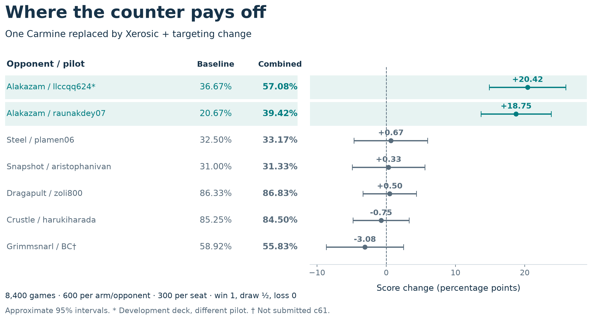

# The Fleet: Building a Research Factory for Pokémon TCG

*Sixty days of solo-directed AI research: turning game questions into experiments, player components, and reusable lessons.*

Jonathan Simone

## The strategy behind the player

A Pokémon TCG player can take a prize now and leave itself without an attacker next turn. How could I discover decisions that improve the whole game, then teach them to an agent? My strategy was to build a research factory around that problem.

Over roughly sixty days, I learned the game as a solo developer directing AI research and coding agents across vendors, calling them The Fleet. I organized their work around a scientific cycle: investigate a question, build the necessary tool, test a hypothesis, challenge the interpretation, and preserve what should change next. This produced original learning components, experiments in teaching and representation, and a deck-policy counter with approximately 19–20 percentage-point gains against two tested Alakazam implementations. [1–6]

The research factory operated; its intended endpoint—a learned player that repeatedly retained those discoveries—remains unfinished. My Simulation entry was Tetsutani's unmodified public Grimmsnarl ex Damage-Transfer Control, policy c61e540b and deck 92b92bac. Its September 6 score was 834.0, rank 840/6,807. The experimental results below belong to their identified development branches. [7]

## Organize inquiry, implementation, and challenge

Across the campaign, I used a strategy lead, researchers, implementers, agents responsible for two compute machines, and separate reviewers. An adversarial role challenged assumptions and experimental claims. I set the objectives and constraints and redirected work when evidence challenged the plan. In the experiments reported here, the tested policies selected moves; Fleet agents conducted development and evaluation. [1]

Roles had concrete purposes. Researchers investigated mechanics, literature, and public policies; implementers turned hypotheses into controlled changes; reviewers checked the artifacts and interpretation. Different vendors supplied additional perspectives, while source inspection and tests settled disagreements. This was a human-directed process with evolving coordination tools.

For example, a second-machine counter comparison initially stopped because its committed opponent registry could not reconstruct the intended panel. Repairing that handoff preceded the comparison. The useful result of review was an experimental condition corrected before it could contaminate the conclusion. [1,6]

*Figure 1. The operated research cycle. The separate dashed path marks the intended transfer into successive stronger learned players; that endpoint has not been demonstrated.*

## Discover what the learner could use

Public players supplied working teachers and material for investigation. In one study, we replayed recorded decisions from Roman Rozen's V13 policy and compared its choices with our working pilot. Disagreements suggested three testable behaviors: establishing Riolu, promoting Mega Lucario ex, and choosing when to evolve. These observations became separate policy modules. A disagreement identified a hypothesis; its frequency alone did not establish which action was better. [2]

Search raised another prerequisite: could we faithfully test alternatives from a recorded position? A replay-state proof of concept matched seven transitions before shuffled menus exposed the need to translate actions by their meaning instead of reusing option numbers. This established a small building block for counterfactual experiments, with broader continuation and useful alternative-action selection still unproved. [2]

Labeling raised a related question: what information could the trainer actually absorb? Parallel investigations examined the training consumer, labeling methods, local-model behavior, and failure cases. Inspecting the loss revealed that the proposed weighting labels ultimately entered training through one relative scalar per row. A richer taxonomy could improve how that scalar was estimated, but added categories alone did not create new learning channels. [3]

An initial batch of 46 quarantined model drafts all mapped to the default weight under the declared mapping. That redirected attention toward the evidence supplied to the labeler and its downstream consumer. One agent extracted episode evidence, another built an enriched projection, and the second machine ran a small local-model comparison on eight previously inconclusive episodes. Five then produced non-abstaining explanations. Their correctness and training benefit remained unestablished; under the original weight mapping, all eight still received default weight. The lesson was actionable: test the entire evidence-to-training path before scaling label production. [3]

## Give decisions enough meaning

Useful supervision also depends on what the learner can represent. In a cached imitation probe, an identity-embedding variant improved mean raw validation accuracy from 48.62% to 74.25% across three matched seed/split comparisons. This measured agreement with recorded decisions, using a cache with 44,343 examples. The variant also increased model capacity; this was an imitation result, not a playing-strength comparison. [4]

A separate bootstrap line repeatedly failed its fidelity gates with a hashed representation. That led us to rebuild the information interface while retaining working replay and training components. My current v2 learner explicitly links legal options to their available sources and targets. A 256-unit recurrent network supplies context across decisions, and the observation projection uses the acting player's view. The changing legal menu is scored through its features instead of treating an option's position as a permanent meaning. [5]

Optional choices also matter strategically. An effect allowing up to three selections may be best used with fewer. My sequential decoder selects without replacement, updates its context, and permits a learned STOP after the minimum. For unordered targets, the training objective sums the probabilities of valid selection orders, so selecting the same set in another order is acceptable. These are implemented components; seven runnable checks with prescribed scores demonstrate their selection constraints. [5]

Complete games remained a separate test. In an August experiment, 1,358 teacher-labeled learner decisions were mixed into training. The selected checkpoint improved its validation loss but won only 23 of 1,200 decided games against exact c61 on the same Grimmsnarl deck. That historical checkpoint differs from current v2. Better imitation had not established a competitive replacement. [5,7]

## Treat the deck and policy as one strategic object

The retained Grimmsnarl deck provided a concrete resource-allocation problem. Its 18 Pokémon, 32 Trainers, and 10 Darkness Energy support attacker development and distributed damage. Grimmsnarl's evolution ability accelerates Darkness Energy onto Marnie's Pokémon. Froslass places counters on Pokémon with Abilities on both sides, except Froslass; a Darkness-powered Munkidori can transfer up to three counters from a friendly Pokémon to an opponent. Grimmsnarl's Shadow Bullet deals 180 to the Active and 30 to a Benched target. [7]

An Energy attachment can enable Munkidori's transfer or prepare another attacker. Boss's Orders brings a prepared target Active; recovery preserves resources for later turns. These interactions explain why I evaluated complete deck-policy combinations. My pre-deadline selection review required reliable execution and reproducible whole-game benefit before replacing c61; the reviewed alternatives had not met that standard. [7]

The clearest positive case used a derivative of makthanithin's Apache-2.0 community_1084 Lucario policy. Mega Lucario ex's Aura Jab deals 130 for one Fighting Energy and can attach up to three discarded Basic Fighting Energy to Benched Pokémon. Mega Brave deals 270 for two Fighting Energy but cannot be reused by that Pokémon next turn. Preparing a successor attacker therefore matters alongside taking the current prize. [6]

Against Alakazam, we tested pressure on two resources. Powerful Hand places two damage counters per card in its player's hand. Replacing one Carmine with Xerosic gave the pilot a way to reduce a large opposing hand to three. Separately, modified targeting preferred visible Abra or Kadabra when the Alakazam line was detected, threatening future attackers. Disruption costs a Supporter opportunity; targeting an evolving threat can forgo another prize. These tradeoffs made the whole-game comparison essential. [6]

| | Original list | Carmine replaced by Xerosic |
|---|---|---|
| Original targeting | Control | Card change |
| Modified targeting | Rule change | Combined intervention |

One complete four-arm experiment used 8,000 games. The pooled development analysis used 28,000 records including that experiment: two comparisons for targeting, three each for card and combination, with within-batch controls on a 40%-Alakazam panel. With draws excluded and inverse-variance pooling, estimated gains were +3.62 percentage points for targeting, +5.02 for the card, and +7.82 [6.08, 9.55] combined; brackets give a 95% interval. These estimates share factorial arms; the interaction did not establish synergy. All three combined comparisons were positive, including the second-machine reproduction. [6]

*Figure 2. A later 8,400-game panel: 600 games per arm per opponent, balanced by seat; win = 1, draw = ½, loss = 0. Approximate 95% intervals condition on these implementations and independent games. One Alakazam deck overlaps development under another pilot.*

The two Alakazam cells improved by 20.42 and 18.75 points. The other five averaged −0.47 [−2.64, +1.71]. The factory had found a substantial conditional counter, with broader benefit unresolved. A separate 16,000-game comparison against exact c61 estimated −0.14 [−1.68, +1.40] points with draws excluded. That result did not establish equivalence. Terminal records support these product comparisons without identifying which individual sequences caused each win. [6]

## Make the next investigation remember

As work accumulated, context became a research bottleneck. A proposed lethal-search rerun was withdrawn when we found an earlier audit already on disk. That incident helped motivate an inventory connecting questions, methods, results, corrections, limitations, and conditions for reopening a hypothesis. Recovering the earlier audit and its limits changed the next research decision. [8]

The factory also needed correction. Independent review found that the memory reader dropped an introductory retraction even though its source hashes were correct. The repair preserved that text and added a regression check that it remained visible and searchable. This memory across research sessions is distinct from a player's recurrent memory and from changes to trained weights. [1,8]

My contribution is the research method and its concrete outputs: inspectable player components, tested teaching and representation choices, a controlled matchup counter, and a record that can challenge the next idea. The next generation I envision connects those pieces: teach validated decisions to a student, test fresh complete games against its parent, then repeat while checking earlier matchups. The research cycles documented here are the foundation for that still-uncompleted learning loop.

## Evidence and acknowledgements

Source notes map [1] Fleet operation and review; [2] policy dissection; [3] labeling; [4] representation; [5] learning components and teaching; [6] counter experiments; [7] submission and deck; [8] memory and corrections. Supporting records distinguish source inspection, retained historical results, reproducible arithmetic, and unresolved execution details. Public teachers are credited; recurrent and imitation-learning methods are established. AI agents assisted implementation, analysis, and writing under my direction.
